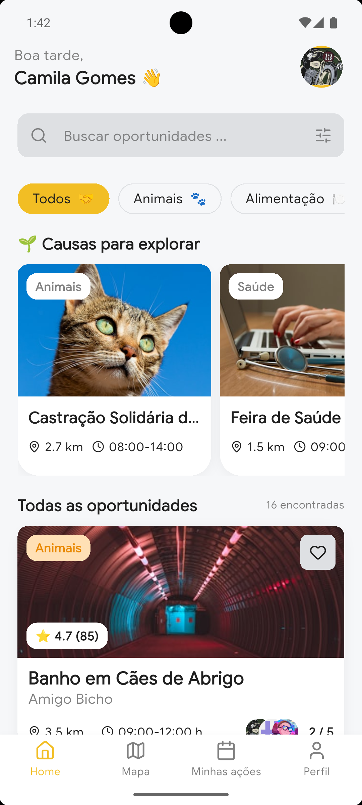
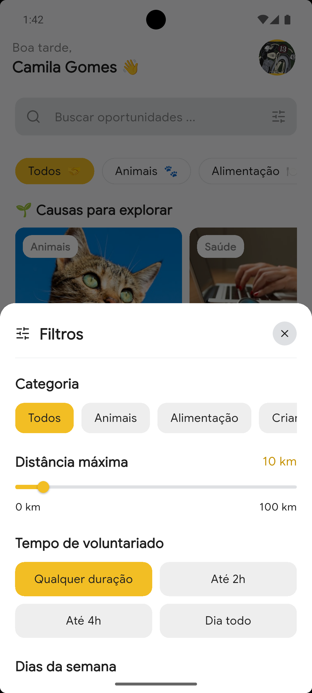
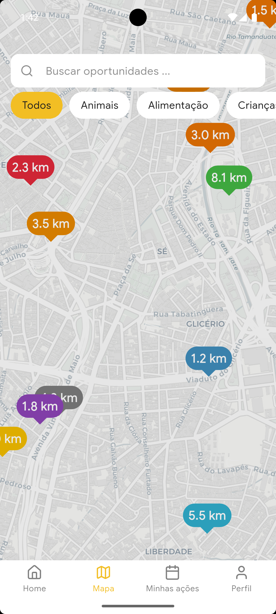
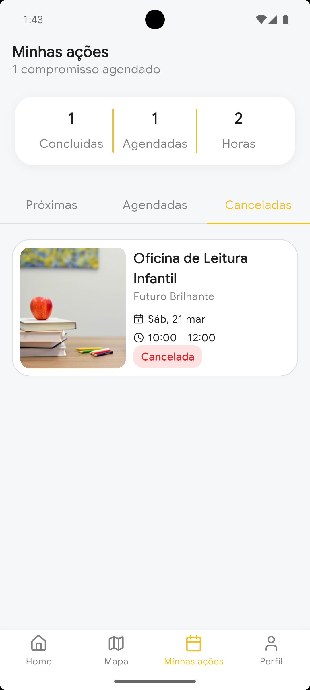
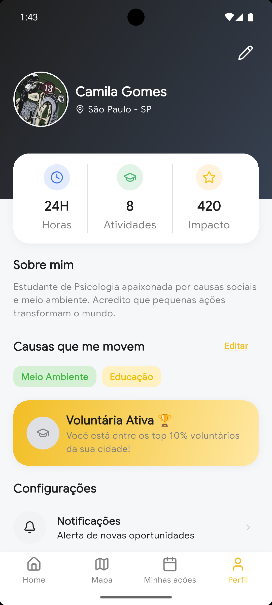
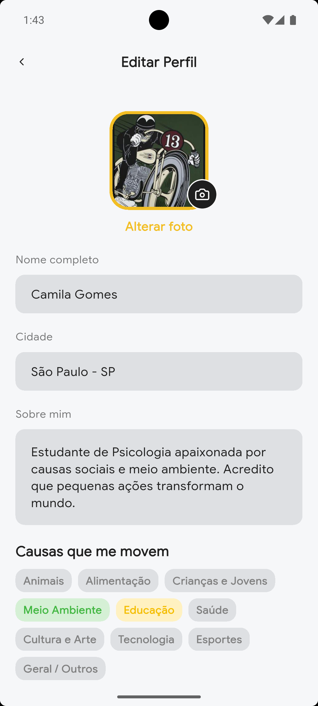

# 🤝 VIA - Volunteers in Action

O **VIA** é um aplicativo mobile desenvolvido em Flutter que conecta pessoas dispostas a ajudar com organizações que precisam de voluntários.

---

### 📱 Demonstração da Interface

Para as imagens não ficarem "tudo junto", usamos tabelas. Isso força o alinhamento lado a lado e cria uma moldura organizada.

| **Home** | **Filtros** | **Mapa** |
| :---: | :---: | :---: |
|  |  |  |

  | **Minhas Ações** | **Perfil** | **Editar Perfil** |
| :---: | :---: | :---: |
|  |  |  |

---

### 🎥 Vídeo de Demonstração

Para o vídeo ficar em destaque, coloque-o entre linhas em branco:

https://github.com/Gpeder/via_app/blob/main/assets/images/video.mp4

---

### ✨ Funcionalidades Principais

* **📍 Mapa de Oportunidades:** Localize vagas baseadas na sua localização.
* **🔍 Filtros Inteligentes:** Busque por categorias ou distância.
* **📅 Agendamento Simples:** Escolha horários e confirme sua participação.
* **👤 Perfil de Impacto:** Acompanhe horas e atividades concluídas.

---

### 🛠️ Tecnologias

* **[Core UI](https://github.com/Gpeder/core_ui):** Biblioteca própria de componentes.
* **Google Maps & Flutter Map:** Visualização geográfica.
* **Lucide Icons:** Ícones modernos.

---

**Desenvolvido com ❤️ por Gustavo.**
